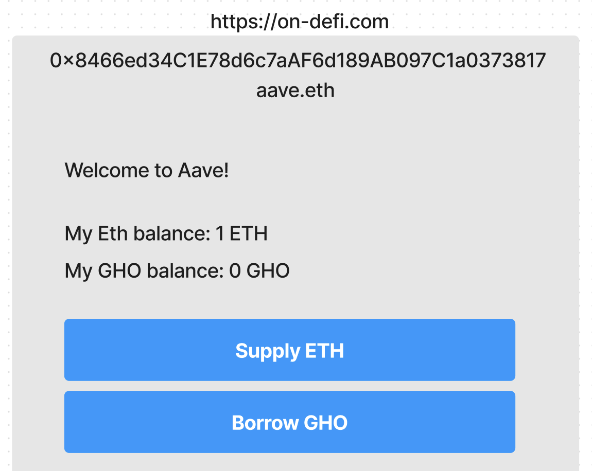

# yieldnest-istanbul
 YieldNest streamlines decentralized finance (DeFi) with a unified GUI, offering account abstraction, self-custody, and modularity.
 
[See here a link to our pitchdeck](https://github.com/amadeobrands/yieldnest-istanbul/blob/main/assets/YieldNest%20__%20Istanbul%20V0.2.pdf)

## YieldNest Core Design

Decentralized Finance (DeFi) is a growing sector promising transparent and independent financial empowerment worldwide. However, its complexity, including intricate cryptography, poses challenges for users. YieldNest simplifies this by offering a user-friendly, modular interface for DeFi, enhancing risk management and ensuring privacy and ownership. Our platform, available as a progressive web app, provides personalized experiences and robust security, allowing users to manage private keys securely. YieldNest's approach minimizes risks and offers a degree of self-custody beyond traditional banking, by constructing decentralized layers atop core DeFi infrastructure.

## Solidity Terminal Module

Simplify and Unify user interfaces, pulled directly from the blockchain, no DNS involved.

### Spark UI Terminal Module

[Spark UI contract on gnosis mainnet chain](https://gnosisscan.io/address/0xc193a5a5a24588fb550211cecbfc2fa64296792f#readContract)

[Aave UI contract on gnosis mainnet chain](https://gnosisscan.io/address/0x8466ed34c1e78d6c7aaf6d189ab097c1a0373817#readContract)

