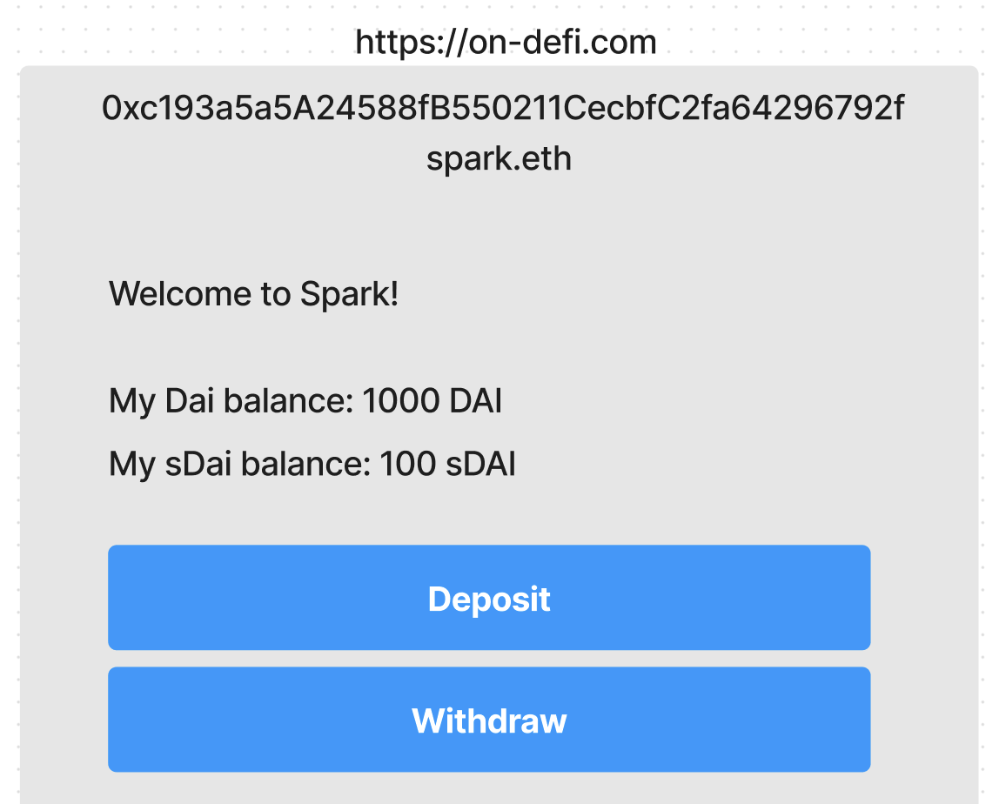

# yieldnest-istanbul
 YieldNest: Simplified DeFi Frontend, Self-Custodial and Modular

## Solidity Terminal

Simplify and Unify user interfaces, pulled directly from the blockchain, no DNS involved.

### Spark UI Terminal

[UI contract on gnosis mainnet chain](https://gnosisscan.io/address/0xc193a5a5a24588fb550211cecbfc2fa64296792f#readContract)

